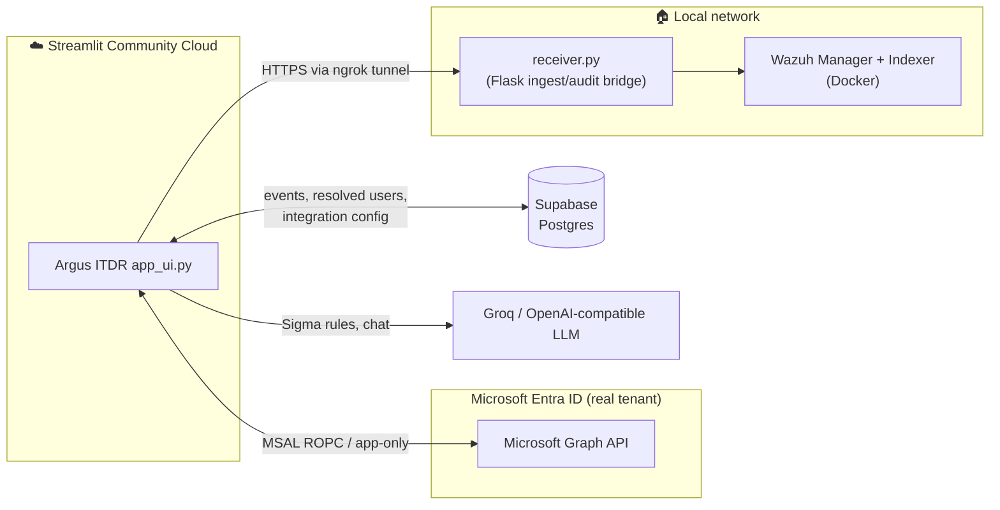

<div align="center">

# 🛡️ Argus ITDR

**Autonomous, AI-powered Identity Threat Detection & Response for Microsoft Entra ID**

[](https://argusplatform.streamlit.app)
[](https://streamlit.io)
[](https://supabase.com)
[](https://wazuh.com)
[](https://groq.com)
[]()

[**🚀 Live App**](https://argusplatform.streamlit.app) · [Features](#-features) · [Architecture](#-architecture) · [Quick Start](#-quick-start)

</div>

---

Argus ITDR detects, analyzes and responds to identity-based attacks against a real Microsoft Entra ID tenant — in real time, with AI-assisted triage and one-click remediation. It's built as a working demonstrator of a modern cloud-identity security operations workflow: **detect → AI-analyze → decide → remediate → report**, backed by a live SIEM pipeline.

## ✨ Features

| | |
|---|---|
| 📥 **Live Log Ingestion** | Upload CSV sign-in logs or stream live telemetry; automatic risk classification (COMPROMISED / ATTEMPTED). |
| 🤖 **AI Threat Analysis & Auto-Fix** | LLM-generated [Sigma](https://github.com/SigmaHQ/sigma) detection rules, validated against the Sigma spec, plus guided one-click remediation. |
| ⚔️ **Red Team Attack Controller** | Real MSAL/Graph attack simulations (password spray, brute force, MFA fatigue, device-code phishing, enumeration) against your own test tenant. |
| 🛡️ **Blue Team & ITDR Dashboard** | Live incident feed, smart-lockout watchlist, compromised-account tracking. |
| 📊 **Interactive Analytics** | Attack intensity timeline, top targeted accounts, failure/success breakdowns. |
| ⚙️ **SIEM Integration** | Real-time dispatch to Wazuh via a secure ingest bridge, with full audit trail. |
| 🔌 **Integrations UI** | Configure SIEM connection settings directly from the app — no redeploy needed. |
| 🤖 **AI Copilot** | Always-on sidebar assistant (Groq-backed) for SOC analyst Q&A. |
| 📄 **Executive Reporting** | One-click PDF security audit reports with posture scoring and remediation history. |
| 🔐 **Public browsing, gated actions** | The whole app is explorable without an account — login is required only for state-changing or outbound actions. |

## 🏗️ Architecture

Argus runs as a Streamlit Cloud app with **no direct network path** to the operator's home lab — a lightweight ingest bridge tunnels events through to a local Wazuh stack, while persistent state lives in Supabase.



## 🔐 Access Model

- **Browsing is free** — every page (dashboards, analytics, reports) is explorable without signing in.
- **Actions require login** — anything that mutates data or talks to an external system (running an attack, executing remediation, dispatching to SIEM, generating a Sigma rule, editing integration settings) prompts for authentication first.

## 🧰 Tech Stack

- **UI:** [Streamlit](https://streamlit.io)
- **Database:** [Supabase](https://supabase.com) (Postgres)
- **Identity:** Microsoft Entra ID via [MSAL](https://github.com/AzureAD/microsoft-authentication-library-for-python) / Microsoft Graph
- **SIEM:** [Wazuh](https://wazuh.com) (self-hosted, Docker)
- **AI:** Groq / any OpenAI-compatible endpoint (chat + [Sigma](https://github.com/SigmaHQ/sigma) rule generation, validated with `pySigma`)
- **Reporting:** ReportLab (PDF)

## 📁 Project Structure

```
argus-platform/
├── app_ui.py                 # Streamlit app: routing, pages, UI logic
├── receiver.py                # Local ingest & audit bridge (tunneled via ngrok)
├── modules/
│   ├── config.py               # Centralized env-var configuration
│   ├── storage.py               # Supabase-backed persistence (events, resolved users)
│   ├── db.py                     # Supabase client singleton
│   ├── integrations.py            # UI-managed SIEM integration settings
│   ├── ai_generator.py             # LLM switcher: Sigma rule generation + chat
│   ├── wazuh_auditor.py             # Audit-trail reads + compliance checks
│   └── attack_engine.py              # Red Team engine (MSAL/Graph, real tenant)
└── supabase/
    └── schema.sql             # One-time Supabase schema setup
```

## ⚡ Quick Start

```bash
git clone https://github.com/blzzz7/argus-platform.git
cd argus-platform
pip install -r requirements.txt
cp .env.example .env   # fill in the variables below
streamlit run app_ui.py
```

## ⚙️ Configuration

All configuration is environment-variable based (`.env` locally, Secrets on Streamlit Cloud) — nothing sensitive is ever hard-coded.

| Variable | Purpose |
|---|---|
| `SUPABASE_URL`, `SUPABASE_KEY` | Persistence layer (events, resolved users, integration config) |
| `ARGUS_TENANT_ID`, `ARGUS_CLIENT_ID`, `ARGUS_CLIENT_SECRET` | Entra ID app registration (Red Team engine + remediation) |
| `ARGUS_ADMIN_USER`, `ARGUS_ADMIN_HASH` | Panel login (SHA-256 hashed) |
| `ARGUS_INGEST_URL`, `ARGUS_INGEST_TOKEN` | Cloud → home SIEM ingest bridge |
| `WAZUH_*` | Wazuh Indexer audit-read connection |
| `AI_MODE`, `LLM_BASE_URL`, `LLM_API_KEY`, `LLM_MODEL` | AI provider (Groq or any OpenAI-compatible API) |
| `ENABLE_REAL_REMEDIATION` | `false` = simulation only, `true` = real Entra ID changes |

## ⚠️ Responsible Use

The Red Team engine executes **real authentication attempts and account changes against the configured Microsoft Entra ID tenant.** Only point it at a tenant you own or have explicit written authorization to test. See `modules/attack_engine.py` for details.

## 🗺️ Roadmap

- [x] Supabase-backed persistence
- [x] Public landing page + free navigation, action-level auth
- [x] UI-managed SIEM integration settings
- [x] AI sidebar copilot
- [ ] Multi-user accounts (beyond single admin)
- [ ] Additional SIEM connectors (Splunk, Microsoft Sentinel)

---

<div align="center">
<sub>Built by <a href="https://github.com/blzzz7">Rasul Kazimov, Huseyn Huseynov, Aydin Erebov, Ferid Abdullayev</a></sub>
</div>
